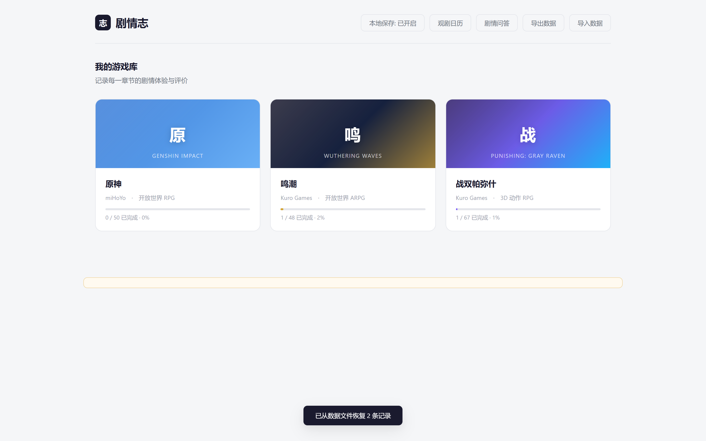
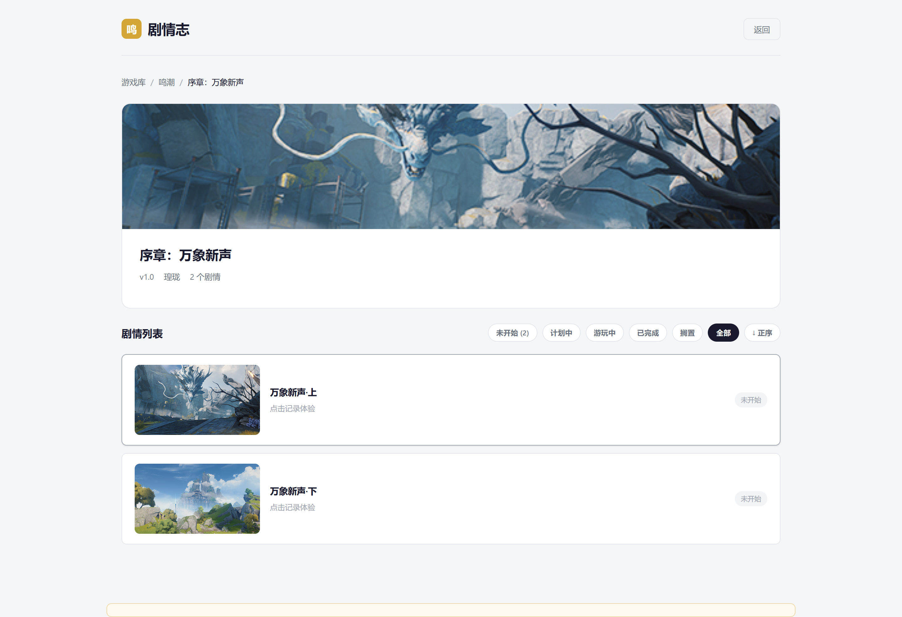
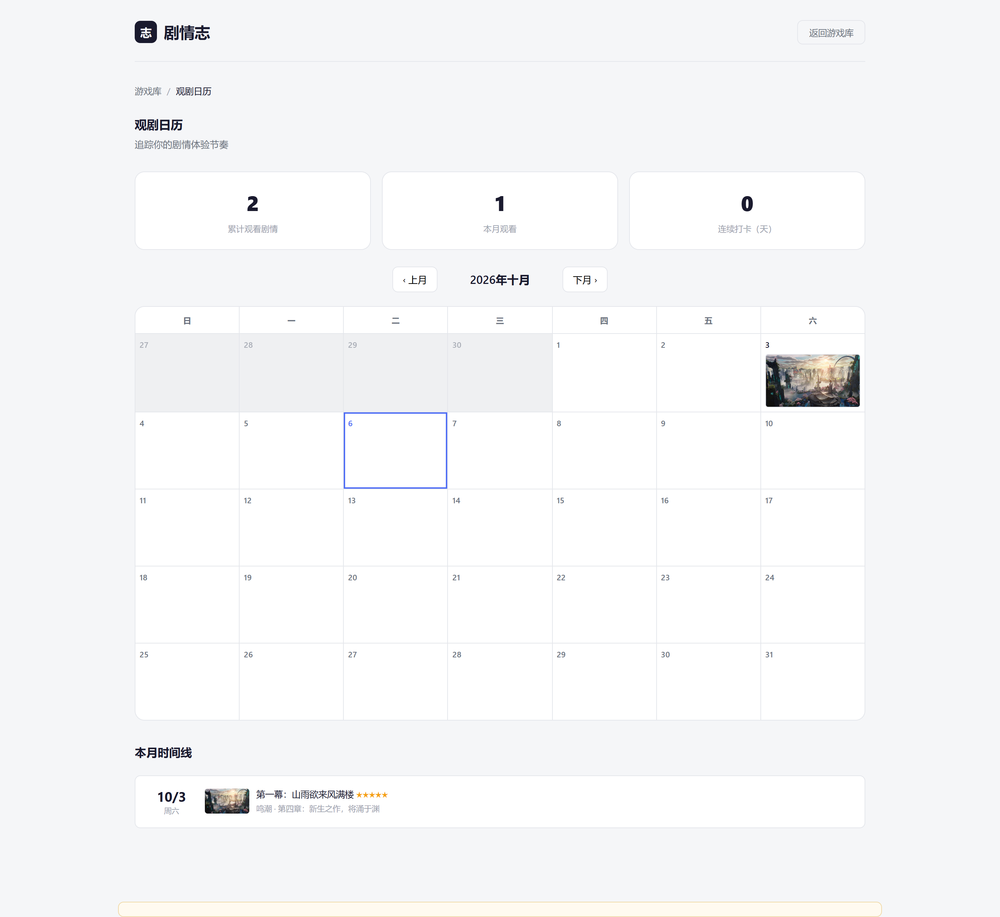
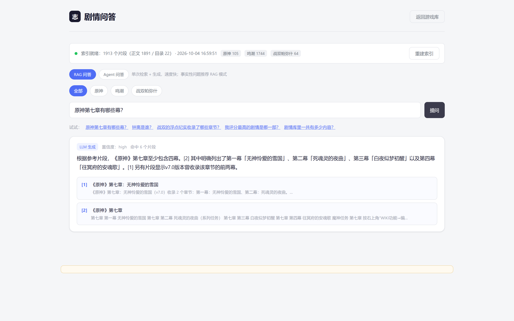
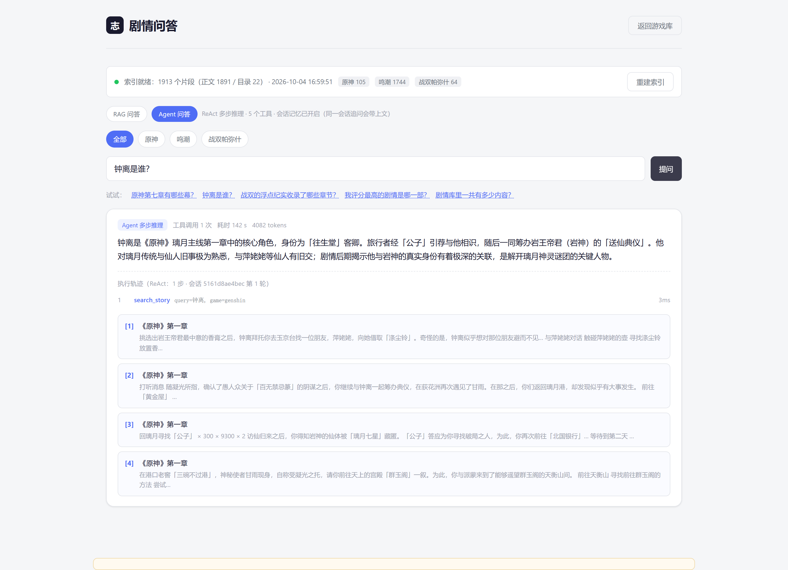

# 剧情志 · Storylog

**面向长线运营游戏（原神 / 鸣潮 / 战双帕弥什）的剧情追踪系统，四条 AI 路径全部落地：`LLM 结构化抽取` · `AI 复盘` · `RAG 剧情问答` · `ReAct Agent 问答`。**

[](https://www.python.org/)
[](#测试)
[](#实测评测结果)
[](#快速开始)
[](LICENSE)

> 零框架：前端是单文件 `index.html`，后端是标准库 `http.server`，检索层是自实现的中文 BM25。
> 装上 `requests / beautifulsoup4 / lxml` 三个包即可跑通全部功能；不配任何 LLM Key 也能用（自动降级为规则 + 纯检索模式，**链路永不空转**）。

---

## 这个项目解决了什么

三款游戏各自在三个不同结构的 wiki 上更新剧情。旧做法是人肉追更、手动核对章节、凭记忆回忆"这章我评价过没有"。
本系统把它做成一条闭环：**追更检测 → 章节同步 → 记录评分 → AI 复盘 → 剧情问答**，并在每一环都留了可降级、可测试的工程边界。

| 环节 | 能力 | 实现要点 |
|---|---|---|
| 追更检测 | 跨三个异构数据源检测剧情更新 | MediaWiki `revision` 比对 + 库街区词条详情 API + 目录快照 diff |
| 章节同步 | 把 wiki 章节树解析成本地结构化数据 | LLM 结构化抽取 + 候选集 URL 交叉核验（防幻觉） |
| AI 复盘 | 基于个人评分/短评生成画像与情感偏差分析 | 规则统计底座 + LLM 分析 + 自检校验，LLM 失败自动退回纯统计 |
| 剧情问答 | 对三源 1913 个正文片段提问 | 自研中文 bigram + BM25 检索，引用白名单核验 |
| Agent 问答 | 让模型自主决定查什么、查几次 | 原生 function calling + ReAct 循环 + 会话记忆 + 五道 Guardrails |

## 界面预览

**游戏库 / 追更总览**



**版本与剧集（含 AI 检测到的新章节）**



**观剧日历**



**剧情问答 · RAG 模式（检索 → 生成，带引用与置信度）**



**剧情问答 · Agent 模式（ReAct 轨迹、工具调用与预算可视化）**



---

## 系统架构

```
                    ┌───────────────────── index.html（单文件前端，五视图）─────────────────────┐
                    │  游戏库    版本/剧集    观剧日历    剧情问答（RAG ⇄ Agent 双模式切换）   │
                    └───────────────────────────────┬──────────────────────────────────────────┘
                                                    │ fetch
                    ┌───────────────────────────────▼──────────────────────────────────────────┐
                    │  server.py（标准库 http.server）                                          │
                    │  /api/data  /api/ask  /api/reindex  /api/index/status  /api/agent         │
                    └───┬───────────────────────┬──────────────────────────┬───────────────────┘
                        │                       │                          │
            ┌───────────▼──────────┐ ┌──────────▼──────────┐  ┌────────────▼──────────────────┐
            │ 路径 D  storylog_     │ │ 路径 C  storylog_    │  │ 路径 A  check_*_wiki.py       │
            │ agent.py             │ │ rag.py              │  │ 路径 B  ai_review.py          │
            │ ReAct + 5 工具        │ │ bigram + BM25 索引   │  │ LLM 抽取 / 复盘分析            │
            │ 记忆 · Guardrails     │ │ 引用白名单防幻觉      │  │ 规则兜底                       │
            └───────────┬──────────┘ └──────────┬──────────┘  └────────────┬──────────────────┘
                        │ 降级                  │                          │
                        └───────────────────────┴──────────┬───────────────┘
                                                            │
                    ┌───────────────────────────────────────▼───────────────────────────────────┐
                    │  storylog_llm.py   共享 LLM 层：OpenAI 兼容调用 / JSON 解析 / schema 重试 /  │
                    │                    限流退避 / 温度自适应（唯一 patch 点）                  │
                    │  storylog_common.py 共享层：目录解析 / 文本归一化 / 浏览器化请求头          │
                    └───────────────────────────────────────────────────────────────────────────┘
                                        ▲ 数据源
                    bwiki MediaWiki · 库街区词条详情 API · 本地记录文件
```

**依赖方向（单向、无循环）**：`storylog_llm ← storylog_common ← check_* / ai_review / storylog_rag ← storylog_agent ← server.py`

把 LLM 调用、限流、JSON 解析全部收进 `storylog_llm` 一个模块，是这个项目最重要的一次重构：
测试只需要 patch 一处，四条路径共用同一套退避与降级策略，新增能力不会长出第二条调用链。

---

## 四条 AI 路径

### 路径 A · LLM 结构化抽取（更新检测）

```
wiki revision / 目录快照 diff  →  规则预筛「疑似新章节」  →  LLM 抽取为 JSON
                              →  schema 校验（失败重试）  →  候选集 URL 交叉核验  →  NEED_SYNC
```

- **候选集交叉核验防幻觉**：模型输出的章节 URL 必须落在真实抓取到的候选集内，越界即丢弃并记 NOTE。
- **规则预筛降本**：200 条候选一次性丢给推理模型会超时；先用规则筛出「疑似章节」子集，单轮从超时降到 **15.5s**。
- **降级**：LLM 不可用时退回纯规则 diff，仍然输出 `NEED_SYNC`，脚本不会因为没 Key 就哑掉。

### 路径 B · AI 复盘

规则层先算出客观统计（评分分布、弃番率、观看节奏），LLM 层只负责在统计底座上做画像与情感偏差分析，
输出再经自检校验；LLM 失败则直接返回统计版报告。

### 路径 C · 剧情问答 RAG

```
索引  三源抓取 → html_to_text 清洗 → 章节感知切分（段落聚合 + 超长硬切 + 邻块重叠）
      → BM25 索引（中文 bigram、章节名 ×2 加权）→ rag_index.json（1913 片段 / 1891 页）
检索  问题 bigram 化 → BM25 Top-K（可按游戏过滤）→（可选）向量混合检索
生成  LLM 仅依据检索片段作答；引用编号必须落在检索结果内，越界引用剔除后回灌修正
```

三个关键取舍：

1. **为什么自研 BM25 而不是上向量库**：实测 Moonshot 不开放 `/embeddings`（`permission_denied`），
   多数场景拿不到稳定向量后端。中文 bigram + BM25 零依赖、可离线、确定性可测；
   同时保留 `STORYLOG_EMBED_*` 接入 OpenAI 兼容向量后端 —— **可插拔而非二选一**。
2. **防幻觉与路径 A/B 同一套哲学**：非法引用"丢弃 + 提示"而非全盘否决；答案正文里的越界 `[n]` 标号也会被剔除。
3. **三档降级**：LLM 生成 → LLM 失败重试（429 退避）→ 纯检索摘要。实测模型会明确回答
   "片段未提供剧情梗概，无法据此说明"而不是编造剧情。

### 路径 D · ReAct Agent 问答

路径 C 是"检索一次 → 生成一次"；路径 D 让模型自己决定**查什么、用哪个工具、查几次**。

```
工具层  5 个只读工具（原生 function calling）
          search_story       三源检索剧情正文
          get_chapters       版本 → 章节层级目录
          get_my_reviews     用户自己的评分 / 状态 / 短评
          get_update_status  三源 wiki 更新检测快照
          get_library_stats  索引规模统计
循环层  Thought → Action → Observation → … → Answer
          步数 / token / 墙钟 三重预算；超预算即禁用工具强制收敛
记忆层  会话级：多轮上下文（可跨轮追问）
        长期级：把用户真实记录压缩成「用户档案」注入 system prompt
```

**五道 Guardrails**：① 工具白名单（模型编造的工具名直接拒绝并把可用列表回灌）；
② 参数类型/枚举校验；③ 工具结果安全截断（**裁剪最长列表字段，保证截断后仍是合法 JSON**）；
④ 提示注入扫描（工具返回正文一律声明为"资料而非指令"）；
⑤ 三重预算熔断。运行模式会在前端透出（`agent` / `agent_forced` / `rag_fallback`），链路走到哪一步用户看得见。

---

## 实测评测结果

自建 **18 题 golden set**（七类场景：检索-角色/章节/事件、目录、个人记录、库统计、更新状态、无需工具、库外应拒答），
被测模型 `kimi-k2.6`，主动限速 `AGENT_RPM=3`：

| 指标 | 结果 | 说明 |
|---|---|---|
| 综合得分 | **98.9 / 100** | 工具 0.4 + 关键词 0.4 + 拒答 0.2 |
| 工具召回率 | **100%**（15/15） | 需调用工具的题全部选对工具 |
| 拒答准确率 | **100%**（2/2） | 库外问题正确拒答，不编造 |
| 运行模式 | **agent 18/18** | 零降级、零限流重跑 |
| 平均步数 | 0.94 步 | 单题 ReAct 步数 |
| 平均 token | 2803 | 单题消耗（合计 50,459） |
| Guardrail 触发 | 0 次 | — |

唯一未满分项 E05（0.80）经人工复核是**打分器口径问题**：模型对库中不存在的「玄翎谣」正确拒答、
并主动给出最接近的「玄翎雀」，被宽口径拒答正则误扣 0.2 —— 属于"不编造优先于强行作答"的正确行为。

完整逐题明细见 [`docs/剧情志-Agent评测报告.md`](docs/剧情志-Agent评测报告.md)。

> 评测集为项目自建，**不宣称通用 benchmark**；关键词采用"命中任一"的宽松判定；
> 单次结果受模型采样随机性影响（kimi-k2.x 被服务端强制 `temperature=1`）。

---

## 快速开始

```bash
git clone <this-repo> && cd storylog
pip install -r requirements.txt

# 1. 起服务（也可直接双击 start-storylog.bat）
python server.py                 # 打开 http://localhost:8090/index.html

# 2. 检查三款游戏剧情更新
python check_all_updates.py

# 3. 构建剧情问答索引（首次必需；约 1913 个正文片段）
python storylog_rag.py --build
python storylog_rag.py --build --max-pages 20   # 少抓一些，更快
python storylog_rag.py --status                 # 查看索引状态

# 4. 命令行问答
python storylog_rag.py --ask "原神第七章有哪些幕？"
python storylog_rag.py --ask "钟离是谁" --game genshin --json

# 5. AI 复盘（读应用导出的 JSON）
python ai_review.py --data 剧情记录数据.json

# 6. Agent 问答（网页「剧情问答」视图可切到 Agent 模式）
python storylog_agent.py --tools                  # 查看可用工具
python storylog_agent.py --ask "我评分最高的剧情是哪一部？"
python storylog_agent.py --chat                   # 多轮对话（会话记忆）

# 7. Agent 评测
AGENT_RPM=3 python agent_eval.py --limit 4
AGENT_RPM=3 python agent_eval.py                  # 全量，输出 markdown 报告
```

### 启用 LLM 内核

不配置则全部功能自动降级为**纯规则 / 纯检索模式**，功能依然可用：

```bash
export LLM_API_KEY=你的Key
export LLM_API_BASE=https://api.moonshot.cn/v1
export LLM_MODEL=kimi-k2.6
export LLM_TIMEOUT=120
```

其余可调项（向量后端、Agent 预算与限速）见 [`.env.example`](.env.example)。

> ⚠️ **限流是「组织级」配额**。实测 Moonshot 为 **RPM=3 滑动窗口**，且**被拒绝的请求同样计入配额**。
> 两个评测进程并发会各按 3 RPM 发请求、合计超限导致大面积 429（还会同时写同一个结果文件）。
> `agent_eval.py` 已内置**单实例锁**（占用 `127.0.0.1:8099`，进程退出自动释放，不留脏锁文件），
> 重复启动会直接拒绝并说明原因；确需绕过可加 `--lock-port 0`。

---

## 测试

```bash
python tests/run_all.py          # 一键跑全部（六个套件）
python tests/run_all.py --py     # 只跑 Python 套件（不依赖浏览器）
python tests/run_all.py --ui     # 只跑前端端到端（需 playwright + Chrome）
```

| 套件 | 覆盖内容 | 例数 |
|---|---|---|
| `tests/test_llm_path.py` | 路径 A：LLM 抽取 / 匹配 / 防幻觉 / 降级 | 10 |
| `tests/test_ai_review.py` | 路径 B：目录解析 / 统计 / 校验 / 防幻觉 / 稳定性 | 28 |
| `tests/test_rag.py` | 路径 C：分词 / 切分 / BM25 / 引用核验 / 降级 | 42 |
| `tests/test_agent.py` | 路径 D：ReAct / 预算熔断 / 降级 / 记忆 / Guardrails | 39 |
| `tests/test_server_api.py` | 服务接口端到端（起真实服务打 HTTP） | 32 |
| `tests/test_ui_qa.cjs` | 前端剧情问答端到端（Playwright + 系统 Chrome，RAG/Agent 双模式） | 28 |
| | **合计** | **179** |

测试全部使用 mock / 纯检索路径，**不消耗任何 LLM 额度**，可直接在 CI 跑。
跑测试会使用独立索引文件（`tests/.tmp/`），**不会污染生产索引**。

顺带一提，`tests/make_screenshots.cjs` 是本仓库所有 README 截图的生成脚本 —— 界面改了直接重跑即可。

---

## 工程决策与踩坑记录

这些都是真实调试出来的，也是这个项目最值得讲的部分：

1. **数据源的结论被推翻过一次**。最初判断"库街区是 SPA、没有公开正文接口"，
   只索引目录卡片，导致问答搜索永远无结果。后来实测发现词条正文有公开 JSON 接口：
   `POST https://api.kurobbs.com/wiki/core/catalogue/item/getEntryDetail`，
   参数名是 `id` 而**不是** `entryId`（用 `entryId` 返回 `code=2031 词条不存在`），
   正文藏在 `data.content.story.<节点>.flow.raw[].content` —— 注意 `flow` 是 dict 而不是 list。
   修正后索引从 127 块涨到 1913 块，**"搜索都是无结果"的真正原因就在这里**。
2. **`taskIcon` 卡片导致的漏报**。原神魔神任务页的「幕」级条目是图片卡片：
   链接正文为空、页面名在 `title` 属性里、`href` 还是不带 `/ys/` 前缀的相对页名、页内导航是 `#` 锚点。
   四个坑凑在一起才漏报，现已用统一的 `_normalize_anchor`（title 兜底 + href 补全 + 排除锚点）修掉。
3. **截断不能破坏 JSON**。早期工具结果直接切字符串，切出非法 JSON 后模型无法解析。
   改为"裁剪最长的列表字段 + 打 `truncated` 标记"，截断后仍是合法 JSON。
4. **提示注入正则必须够窄**。写成 `你(是|扮演)` 时，剧情对白里的"你是……"被大量误判；
   收紧后在 1913 个真实片段上**误报 0**。防御靠具体模式，不靠"让模型自觉"。
5. **限速的唯一正确姿势是记账对齐**。一开始撞 429 就整轮降级——那是把**限流当故障**，评测测的是配额而不是能力。
   后来改为滑动窗口主动限速 + 指数退避（4s→8s→16s）。但仍有持续 429，抓到两个真实根因：
   ① 上一轮遗留的评测进程与新进程并发抢组织级配额；
   ② `_throttle` 只在调用开头执行一次，**重试的尝试不计入滑动窗口**，而服务端把被拒请求也算配额 → 窗口漏账。
   修复后 18 题评测 **0 次 429、一次跑完**，单题耗时 28.4s → 11.2s。
6. **测试污染过生产数据**。曾经一次 `reindex(maxPages=1)` 把索引从 127 块打回 33 块（又是"搜索无结果"的元凶之一），
   业务数据也被测试覆盖过。现在测试索引走 `STORYLOG_INDEX_FILE` 环境变量隔离，业务数据有原子写 + 滚动备份，
   测试夹具全部独立。
7. **会话快照的时序 bug**。降级路径里先取快照再写记忆，导致返回的"当前轮数"永远滞后一轮。
   这类 bug 不报错、不影响功能，只会让多轮对话的上下文悄悄错位——只有测试能兜住。

## 目录结构

```
storylog/
├─ index.html                 单文件前端（游戏库 / 版本剧集 / 观剧日历 / 剧情问答 五视图）
├─ server.py                  本地服务：静态托管 + 数据持久化（原子写 + 滚动备份）+ 问答接口
├─ start-storylog.bat         一键启动
│
├─ storylog_llm.py            共享 LLM 层（唯一 patch 点）
├─ storylog_common.py         共享层：目录解析 / 归一化 / 浏览器化请求头
│
├─ check_ys_wiki.py           路径 A · 原神更新检测
├─ check_wuwa_wiki.py         路径 A · 鸣潮更新检测
├─ check_pns_wiki.py          路径 A · 战双更新检测
├─ check_all_updates.py       路径 A · 三游戏检测总入口
├─ ai_review.py               路径 B · AI 复盘
├─ storylog_rag.py            路径 C · 剧情问答 RAG
├─ storylog_agent.py          路径 D · ReAct Agent
│
├─ agent_eval.py              路径 D · 评测 harness（含单实例锁）
├─ agent_eval_set.json        路径 D · 自建 18 题评测集
│
├─ tests/                     六个自动化测试套件 + 截图脚本
├─ docs/                      评测报告 / 数据源说明 / AI 复盘输出示例
├─ assets/screenshots/        README 截图
├─ requirements.txt           三个依赖
├─ .env.example               环境变量模板
└─ .gitignore
```

## API

| 方法 | 路径 | 说明 |
|---|---|---|
| GET | `/api/data` | 读取剧情记录 |
| POST | `/api/data` | 保存记录（原子写 + 滚动备份 + `file://` 桥接） |
| GET | `/api/index/status` | 问答索引状态 / 重建进度 |
| POST | `/api/reindex` | 后台重建问答索引 |
| POST | `/api/ask` | 剧情问答（检索 + LLM 生成） |
| GET | `/api/agent` | Agent 工具清单 / 预算 / 会话数 |
| POST | `/api/agent` | Agent 问答（ReAct + 工具调用 + 记忆，支持 `sessionId` 多轮） |

## 已知限制

- **本地优先**：应用依赖本地服务与本地索引文件，没有在线 Demo；界面截图见上方。
- **评测集为自建 18 题**，覆盖面有限，不构成通用 benchmark。
- 鸣潮站点的非剧情词条（资料页/目录页）无正文，会记入 `errors` 并跳过，**不编造内容**。
- bwiki 个别子站有风控（曾返回 567），统一浏览器化请求头后已解决；仍失败则记入 `errors` 跳过，不阻塞整体构建。
- 索引增量复用按 `source_key + 内容哈希` 判断，wiki 正文更新后需重跑 `--build`。
- 前端端到端测试需要本机安装 Chrome 与 playwright。

## License

[MIT](LICENSE)
